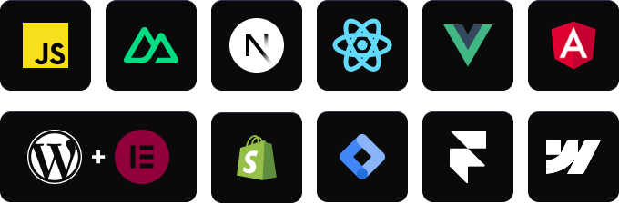

<p align="center">
  
</p>

<h4 align="center">
📚 <a href="https://docs.litlyx.com">Docs</a> 👾 <a href="https://discord.gg/9cQykjsmWX">Discord</a> 🌐 <a href="https://litlyx.com">Website</a>  🔥 <a href="https://dashboard.litlyx.com">Cloud</a> 
</h4>

#
<p align="center">
  <strong>Litlys is the easiest analytics tool you will ever use. It is fast, modern and completely cookie free.</strong><br>
  Install in under <strong>30 seconds</strong>. Self host with Docker or use our hosted cloud.<br>
  A powerful alternative to Google Analytics 4, Posthog and Mixpanel.
</p>

#

<br />

<p align="center">
  
</p>

#

## Get Started on our Cloud Version

Sign up on [Litlyx.com](https://dashboard.litlyx.com) and create a project. Then use your `workspace_id` to connect Litlyx to your website.

## Universal Installation

```html
<script defer data-workspace = "workspace_id" 
src = "https://cdn.jsdelivr.net/npm/litlyx-js@latest/browser/litlyx.js"></script>
```

This minimal setup is all you need to start tracking visitors on your website or web apps with ease.

# Intergrate with everything

You can install Litlyx using `npm`, `pnpm` or any modern package managers:

```sh
npm i litlyx-js
```

Litlyx works with all modern JavaScript and TypeScript frameworks. You can also use Litlyx on any WordPress website by injecting the script with a third party plugin.

<p align="center">  </p>

# Import using a package manager

First, import the litlyx-js library:

```js
import { Lit } from 'litlyx-js';
```

Then initialize Litlyx:

```js
Lit.init('your_workspace_id');
```

Once initialized, Litlyx automatically tracks page visits, real time users, unique visitors and much more.

# Track Custom Events

You can track your own custom events with Litlyx.

```js
Lit.event('click_on_buy_item');
```
If you need more detailed information, you can add `metadata`:


```js
Lit.event('click_on_buy_item', {
  metadata: {
    'product-name': 'Coca-Cola',
    'price': 1.50,
    'currency': 'EUR'
  }
});
```

Litlyx makes it easy to adapt your analytics to your project.

# Fire Your First Event with cURL

Use the command below to send a test event. Replace `workspace_id` with your project ID.

```bash
curl -X POST "https://broker.litlyx.com/event" \
  -H "Content-Type: application/json" \
  -d '{
    "pid": "workspace_id",
    "name": "testEvent1",
    "metadata": "{\"test\": \"something\"}",
    "website": "something",
    "userAgent": "something"
  }'
```

# Self-hosting with docker

To self host the Litlyx dashboard, first clone this repository. Litlyx Docker images are hosted on DockerHub.

Run the following commands in order:

```bash
npm run docker-prepare #use your favourite package manager like pnpm, bun, etc...
```

and than:

```bash
docker-compose up
```

At localhost:3000 you will see your own instance of the Litlyx dashboard.

## Forward data to your self-hosted instance with script tag

To forward your data on your self-hosted instance, you need to set up the following variables: `data-host`, `data-port`,  `data-secure`(`true` if it is HTTPS or `false` if it is HTTP).

```html
<script defer data-project="your_workspace_id" 
        data-host="your-host-name" 
        data-port="your-port" 
        data-secure="true/false"
        src="https://cdn.jsdelivr.net/gh/litlyx/litlyx-js/browser/litlyx.js">
</script>
```

# Unlock the full power of Litlyx self hosting

Litlyx self hosting gives you the freedom to use the full platform for free.  
If you want to scale to more client seats, you can choose one of our lifetime plans available in the [pricing](https://litlyx.com/pricing) section.


# Read our docs

For more info on how to use litlyx read our [documentation](https://docs.litlyx.com). 


# Stay updated with our roadmap

To keep track on what we are cooking behind the scene we have a public [Roadmap](https://litlyx.com/roadmap) for you to check. 


# Join discord

If you need more information, want to interact with us or the community, need help, or have feedback to share, feel free to join us on Litlyx's [Discord](https://discord.gg/9cQykjsmWX) channel.

# Contribution

If you want to contribute to Litlyx's development, reach out to us on [Discord](https://discord.gg/9cQykjsmWX) in our `#contribution` channel.

### Thank you!
<a href="https://github.com/litlyx/litlyx/graphs/contributors">
  
</a>

# Support or Business Inquiries
For any support, write to help@litlyx.com. We are happy to assist you.

# License
Litlyx is licensed under the [Apache 2.0](/LICENSE) license.
