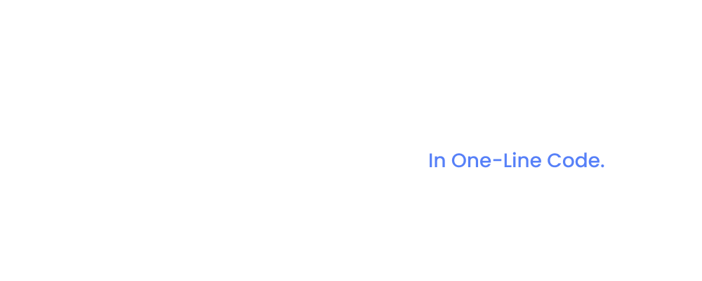

<p align="center">
  
</p>

<h4 align="center">
🌐 <a href="https://litlyx.com">Website</a> 📚 <a href="https://docs.litlyx.com">Docs</a> 🔥 <a href="https://dashboard.litlyx.com">Start for Free!</a>
</h4>

<br />

#

<p align="center">
  The easiest Dev-Centric Analytics tool.<br>Litlyx is , Open-Source, Plug-In everywhere Javascript is Supported. Setup in less then 30 seconds, with just One-Line of code.
</p>

#

<br />

<p align="center">
  
</p>

#


## Pre-Requisites

Sign-up on [Litlyx cloud](https://dashboard.litlyx.com) using OAuth & name your project to get your project_id to connect Litlyx to your website OR Self-Host Litlyx with Docker.

## Universal Installation

```html
<script defer data-project="project_id_here" src="https://cdn.jsdelivr.net/gh/litlyx/litlyx-js/browser/litlyx.js"></script>
```

Importing Litlyx with a direct script already tracks 10 KPIs such as `Page visits`, `Browsers`, `Devices`, `OS`, `Real-Time Online Users`, `Unique Session`, `Countries`, `Average Session Time`.

# All Javascript Runtimes

You can install Litlyx using `npm`, `yarn`, or `pnpm`:

```sh
npm i litlyx-js
```

Litlyx natively supports all  JS/TS frameworks. You can use Litlyx in all WordPress Websites by injecting JS code using a plug-in. Litlyx work in serverless enviroments with Cloud (or Edge) Functions.

<p align="center">
  
</p>

# Import

Import litlyx-js library into your code:

```js
import { Lit } from 'litlyx-js';
```

Once imported, you need to initialize Litlyx:

```js
Lit.init('your_project_id');
```

After initialization, Litlyx will automatically track Analytics such as `Page visits`, `Browsers`, `Devices`, `OS`, `Real-Time Online Users`, `Unique Session`, `Countries`, `Average Session Time`.

# Custom Events

With Litlyx, you can create your own events to track in your project.

```js
Lit.event('click_on_buy_item');
```

If you want more dept tracking, you can use the `metadata` field, like this:

```js
Lit.event('click_on_buy_item', {
  metadata: {
    'product-name': 'Coca-Cola',
    'price': 1.50,
  }
});
```

You can create your Tailor-Made Experience at ease. 

# AI Data-Analyst

<p align="center">
  
</p>

Lit can compare data, query specific metadata, visualize charts, and much more just by having a simple `conversation` with him.


# Self-Hosting with Docker

First thing first **Fork** this repository.

Then run the following command:

```bash
docker-compose build
```

then, after the build finish, run:
```bash
docker-compose up
```

on your localhost you will see your own instance of the Litlyx Dashboard.

# Official Docs

For more info read our [documentation](https://docs.litlyx.com). (will be improved in the near future using Mintlify!)

# Join Discord

If you need more information, help, or want to provide general feedback, feel free to join us on[Discord](https://discord.gg/9cQykjsmWX)

# Contributors

Every kind of contribution is accepted in this stage of the project. In the future we will onboard you better. 

### Thank you!
<a href="https://github.com/litlyx/litlyx/graphs/contributors">
  
</a>

# License

Litlyx is licensed under the [Apache 2.0](/LICENSE) license.
