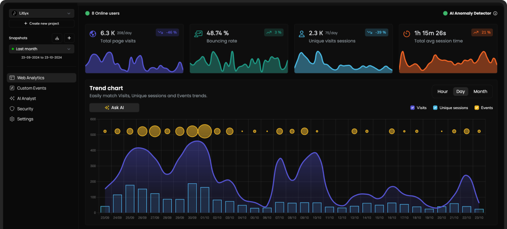

<p align="center">
  
</p>

<h4 align="center">
🌐 <a href="https://litlyx.com">Website</a> 📚 <a href="https://docs.litlyx.com">Docs</a> 👾 <a href="https://discord.gg/9cQykjsmWX">Join Discord</a> 🔥 <a href="https://dashboard.litlyx.com">Try Litlyx Cloud. It's Free.</a> 
</h4>

#
<p align="center">
  The freshest, developer-friendly analytics tool.<br>
  Litlyx is an open-source, self-hostable analytics solution for modern frameworks. Setup takes less than 30 seconds!
</p>

#

<br />

<p align="center">
  
</p>

#

## Get Started on our Cloud Version

Sign-up on [Litlyx.com](https://dashboard.litlyx.com) and create a project. Then simply use your project_id to connect Litlyx to your website OR Self-Host Litlyx with Docker.

## Universal Installation

```html
<script defer data-project="your_project_id" src="https://cdn.jsdelivr.net/gh/litlyx/litlyx-js/browser/litlyx.js"></script>
```

Importing Litlyx with a direct script instantly starts tracking `Page visits`, `Browsers`, `Devices`, `Operating Systems`, `Bouncing Rate`, `Real-Time Online Users`, `Unique Sessions`, `Countries`, and `Average Session Time`.

# All Javascript Runtimes

You can install Litlyx using `npm`, `pnpm`, `yarn` or any modern package managers:

```sh
npm i litlyx-js
```

Litlyx natively works with all JavaScript / TypeScript frameworks. You can use Litlyx in all WordPress Websites by injecting JS code using a plug-in. Litlyx also works in serverless environments with Cloud (or Edge) Functions.

<p align="center">
  
</p>

# Import

Import litlyx-js library into your code:

```js
import { Lit } from 'litlyx-js';
```

Once imported, you need to initialize Litlyx:

```js
Lit.init('your_project_id');
```

After initialization, Litlyx will automatically track analytics such as `Page visits`, `Browsers`, `Devices`, `Operating Systems`, `Real-Time Online Users`, `Unique Sessions`, `Countries`, and `Average Session Time`.

# Track Custom Events

You aren't just limited to the built-in KPIs. With Litlyx, you can create your own events to track in your project.

```js
Lit.event('click_on_buy_item');
```

If you want more specific tracking, you can use the `metadata` field, like this:

```js
Lit.event('click_on_buy_item', {
  metadata: {
    'product-name': 'Coca-Cola',
    'price': 1.50,
    'currency': 'EUR'
  }
});
```

Litlyx makes it easy for you to tailor your analytics to your project's needs.


# Fire Your First Event with cURL

Want to quickly see how Litlyx works with events? Use the cURL command below to send a test event. Just replace the `project_id` with your actual project ID in your terminal.

```bash
curl -X POST "https://broker.litlyx.com/event" \
  -H "Content-Type: application/json" \
  -d '{
    "pid": "project_id",
    "name": "testEvent1",
    "metadata": "{\"test\": \"something\"}",
    "website": "something",
    "userAgent": "something"
  }'
```

# Self-Hosting with Docker

To self-host the Litlyx dashboard, first **fork** this repository.

Then run the following command:
```bash
docker-compose build
```

after the build finishes, run:
```bash
docker-compose up
```

at localhost:3000 you will see your own instance of the Litlyx Dashboard.

## Forward data to your local instance with script tag

To forward your data on your self-hosted instance, you need to set up the following variables: add your `data-host`, add your `data-port`, and add your `data-secure`, setting it to true if it is HTTPS, and false if it is HTTP.

```html
<script defer data-project="your_project_id" 
        data-host="your-host-name" 
        data-port="your-port" 
        data-secure="true/false"
        src="https://cdn.jsdelivr.net/gh/litlyx/litlyx-js/browser/litlyx.js">
</script>
```

# Official Docs

For more info read our [documentation](https://docs.litlyx.com). (will be improved in the near future using Mintlify!)

# Join Discord

If you need more information, interact with us or the community, help, or want to provide  feedbacks, feel free to join us on the Litlyx [Discord](https://discord.gg/9cQykjsmWX)

# Contributors

Every kind of contribution is accepted in this stage of the project. In the future we will improve the contributor onboarding process.

### Thank you!
<a href="https://github.com/litlyx/litlyx/graphs/contributors">
  
</a>

# License

Litlyx is licensed under the [Apache 2.0](/LICENSE) license.
