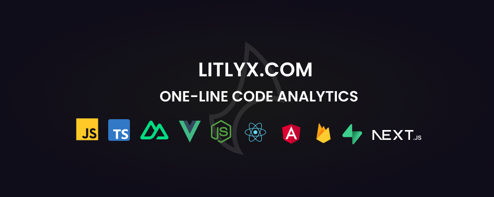
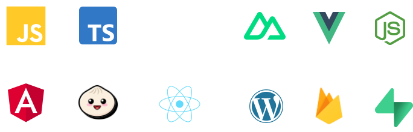

<p align="center">
  
</p>

<h4 align="center">
🌐 <a href="https://litlyx.com">Website</a> 📚 <a href="https://docs.litlyx.com">Docs</a> 🔥 <a href="https://dashboard.litlyx.com">Start for Free!</a>
</h4>

<br />

#

<p align="center">
  A single-line code analytics solution that integrates with every JavaScript/TypeScript framework. <br />
  Track 10+ KPIs and as many custom events as you want for your website or web app.<br />
  An AI Data Analyst Assistant ready to help you!
</p>

#

<br />

<p align="center">
  
</p>

#


#

# Join Litlyx's Community Channel on Discord

If you need more information, help, or want to provide general feedback, feel free to join us here: [Litlyx on Discord](https://discord.gg/9cQykjsmWX)

# Installation

You can install Litlyx using `npm`, `yarn`, or `pnpm`:

```sh
npm i litlyx-js
```

Or import it directly into your JavaScript code:

```html
<script defer data-project="project_id_here" src="https://cdn.jsdelivr.net/gh/litlyx/litlyx-js/browser/litlyx.js"></script>
```

Importing Litlyx with a direct script already tracks 10 KPIs such as page visits, browsers, devices, OS, real-time online users, and many more.

> [!NOTE]
> - If you want to track custom events, you need to import the library with `npm`, `yarn`, or `pnpm`. Continue reading to find out more!

#### You can find the official documentation: [here](https://docs.litlyx.com).

# Supported Frameworks

Litlyx natively supports all these JavaScript/TypeScript frameworks. You can use Litlyx in all WordPress projects by injecting JS code using plugins. You can even use Litlyx in cloud (or edge) functions in BaaS!

<p align="center">
  
</p>

# Usage

Litlyx is very simple to use. The first thing is to import Litlyx into your code:

```js
import { Lit } from 'litlyx-js';
```

Once imported, you need to initialize Litlyx:

```js
Lit.init('your_project_id');
```

After this line, Litlyx will automatically track more than 10 KPIs for you.

> [!NOTE]
> - Create your first project for free! 👉 <a href="https://dashboard.litlyx.com">Create now!</a>

# Customize Your Experience by Tracking Custom Events

With Litlyx, you can create your own events to track in your project on the main CTA. Your creativity is the limit! Customize your experience like this:

```js
Lit.event('main_cta');
```

This is the minimal setup for an event. If you want more control over them, you can use the `metadata` field:

```js
Lit.event('pretty_cool_event', {
  metadata: {
    'tag': 'litlyx is awesome!',
    'age': 27,
    'score': 100.01,
    'list': ['Hello', 'World!']
  }
});
```

And that's it! You have set up your first custom event. From now on, you know how to set them up. With events you can track even the user flow, from where they come to the final Click!

# Lit, the AI Data Analyst at Your Service

<p align="center">
  
</p>

Litlyx comes with an integrated AI that can analyze your collected data and your entire history. It can compare data, query specific metadata, visualize charts, and much more.

You can have a `conversation` with Lit in the dashboard  👉 [here](https://dashboard.litlyx.com).

# You Are Free to Self-Host Litlyx

Litlyx is completely open-source, and you are free to self-host it and create your own version of the dashboard. We are always open to conversations with all contributors to the project, so contact us at `helplitlyx@gmail.com` to schedule a call with us!

We hope to hear from you!

# Official Docs

Read the complete documentation at [https://docs.litlyx.com](https://docs.litlyx.com).

# Contact

Write to us at `helplitlyx@gmail.com` if you need to contact us.

# License

Litlyx is licensed under the [Apache 2.0](/LICENSE.md) license.

# Share some ❤️ for the repo

If you like what you see, join us and start collaborating! Leave a star (⭐) to stay updated on our progress and show your support.

### Let's change analytics landscape togheter!

<a href="https://github.com/Litlyx/litlyx" style="display:inline-block;background-color:#5680F8;color:white;padding:10px 20px;text-align:center;text-decoration:none;font-size:16px;border-radius:5px;" target="_blank" rel="noopener noreferrer">⭐ Leave a Star</a>

We are on track! `Thanks for your support!` 